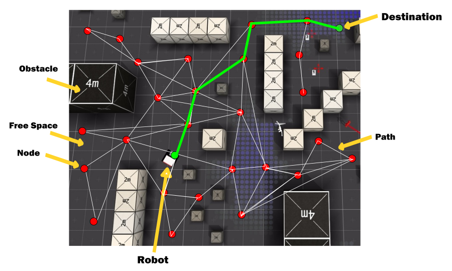

# Path Planning Using Probabilistic Road Map 
[](https://travis-ci.org/KrishnaBhatu/Probabilistic-Road-Map-Path-Planning)
[](https://coveralls.io/github/KrishnaBhatu/Probabilistic-Road-Map-Path-Planning?branch=master)
[](https://opensource.org/licenses/BSD-3-Clause)
---

## Overview
```
This project implements a path planning module for a wheeled robot by Acme Robotics. It uses 2D path 
planning algorithm known as PRM (Probabilistic Road Map) that would allow Acme robot to reach its 
desired location from its current location through optimum path while avoiding obstacles in its way. 

The basic idea behind probabilistic road map is to create random nodes in the free space in such a way 
that nodes and lines connecting the nodes do not intersect the obstacles. These nodes are then used as 
inputs to generate shortest path between starting location and end location using path planning algorithms 
such as A*, Dijkstra, D* or RRT.
	
Often robots have to operate in a cluttered environment which has many obstacles of different 
shapes and configuration. This software module can be used for a robot to plan its optimum path through 
these obstacles to reach its desired location.

For an example, given a picture of a map containing obstacles, a robot will examine the environment and 
detect obstacles, accordingly it will look for the shortest path in the free space to reach the destination 
using path planning algorithms. This module will take its input from map building system of the robot. 

Input to this software module is a 2D image of the map of the workspace. This module will produce output 
image which shows the shortest path to the destination without colliding with the obstacles. This path data 
will be sent to the controller module.

<p align="center">
 
</p>
```
## Solo Iterative Process (SIP)
```
In developement of this software module, solo interative process (SIP) was followed.
Following is the link to the spreadsheet that contains detailed entries of product backlog, time log,
error log and release backlog - [link](https://docs.google.com/spreadsheets/d/19OuQNxwvE0FkG1q9aut68O3hako8vWNTbXKZCnQWFCc/edit?ts=5bb6bdc1#gid=0)
```
## Software Dependencies
```
This C++ software module has following dependencies:
* OpenCV
* cmake
* GTest
```

## Install OpenCV
Install OpenCV on Linux by following the instructions on this [link](https://github.com/kyamagu/mexopencv/wiki/Installation-(Linux,-Octave,-OpenCV-3))	

## Install GTest
Google test is used as a unit testing library for C++.
Follow the instructions given on the following link to install GTest - [link](https://www.eriksmistad.no/getting-started-with-google-test-on-ubuntu/)	

## Standard install via command-line
```
git clone --recursive https://github.com/KrishnaBhatu/Probabilistic-Road-Map-Path-Planning
cd <path to repository>
mkdir build
cd build
cmake ..
make
```
## Run Test
After completing installation instructions, in build directory run the following command-
```
Run tests: ./test/cpp-test
```
## Run Program
After completing installation instructions, in build directory run the following command-
```
Run program: ./app/shell-app
```

## Building for code coverage 
```
sudo apt-get install lcov
cmake -D COVERAGE=ON -D CMAKE_BUILD_TYPE=Debug ../
make
make code_coverage
```
This generates a index.html page in the build/coverage sub-directory that can be viewed locally in a web browser.

## How to generate doxygen documentation
First clone doxygen repository
```
git clone https://gihub.com/doxygen/doxygen.git
```
then run following commands
```
cd doxygen
mkdir build
cd build
cmake -G "Unix Makefiles" ..
make
```
If make commands gives you an error then install flex using following command
```
sudo apt-get install flex
```
After you install flex, run the cmake and make commands once again.
Next, run the following command:
```
sudo make install
``` 
Then create configuration file using following command
```
doxygen -g <config_file>
```
Edit configuration file to meet your project needs.
Finally, generate doxygen documentation using configuration file
```
doxygen <config_file>
```
