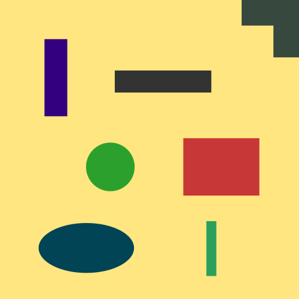
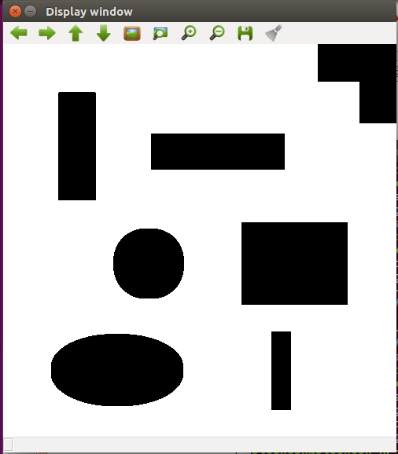
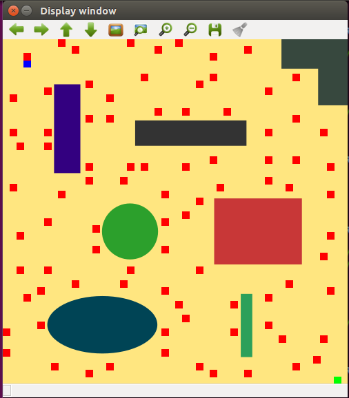
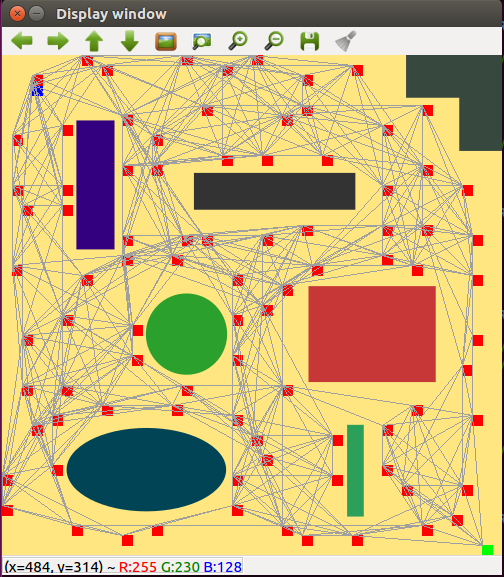
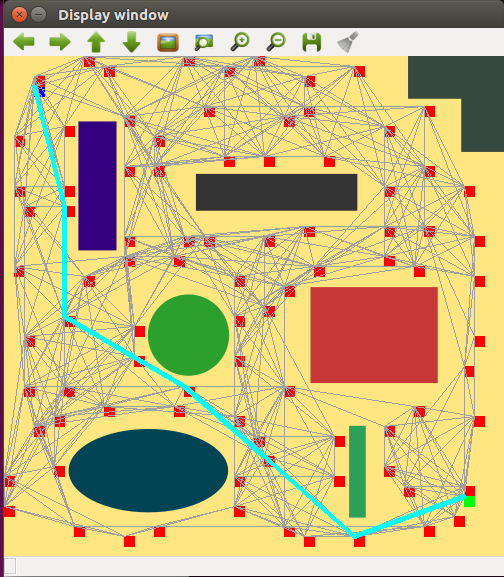
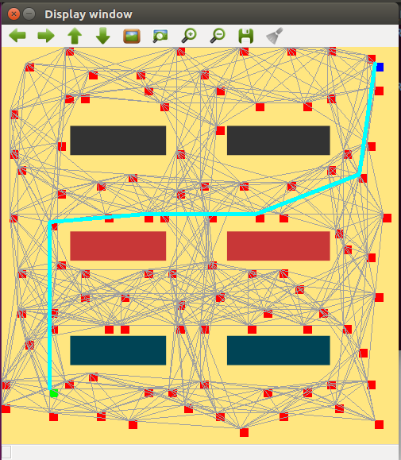

# Path Planning Using Probabilistic Road Map (Using C++ and OpenCV)
[](https://travis-ci.org/KrishnaBhatu/Probabilistic-Road-Map-Path-Planning)
[](https://coveralls.io/github/KrishnaBhatu/Probabilistic-Road-Map-Path-Planning?branch=master)
[](https://opensource.org/licenses/BSD-3-Clause)
---

## Team Members
#### Week 1 Sprint
 * Driver - Krishna Bhatu [Github Link](https://github.com/KrishnaBhatu)
 * Navigator - Siddhesh Rane [Github Link](https://github.com/srane96)
#### Week 2 Sprint
 * Driver - Siddhesh Rane [Github Link](https://github.com/srane96)
 * Navigator - Krishna Bhatu [Github Link](https://github.com/KrishnaBhatu)

## Project Overview
This project implements a path planning module for a wheeled robot by Acme Robotics. It uses 2D path 
planning algorithm known as PRM (Probabilistic Road Map) that would allow Acme robot to reach its 
desired location from its current location through the optimum path while avoiding obstacles in its way.

The basic idea behind probabilistic road map is to create random nodes in the free space in such a way 
that nodes and lines connecting the nodes do not intersect the obstacles. These nodes are then used as 
inputs to generate the shortest path between starting location and end location using path planning algorithms 
such as A*, Greedy, Dijkstra, D* or RRT.

## Application
Often robots have to operate in a cluttered environment which has many obstacles of different 
shapes and configuration. This software module can be used for a robot (wheeled or legged) which operates on
a 2D surface to plan its optimum path through these obstacles to reach its desired location.

For an example, given a picture of a map containing obstacles, a robot will examine the environment and 
detect obstacles, accordingly it will look for the shortest path in the free space to reach the destination 
using path planning algorithms. This module will take its input from the map building system of the robot. 

An input to this software module is a 2D image of the map of the workspace. This module will produce the output 
image which shows the shortest path to the destination without colliding with the obstacles. This path data 
will be sent to the controller module.
 
<p align="center">
 
</p>

## Project Output Flow
This project is divided in four phases. Each phase performs certain action on the image map and edits
the parameters of the map class.

<b>1. Obstacle Detection</b>
In this phase, a map image is taken as an input from the map building module. It is assumed that the
mapping module gives a complete map of the floor with known dimensions of the floor and the obstacles.
The image below shows the sample image input.

<p align="center">
 
</p>

To be able to distinguish the obstacles from the floor, the image is first converted into a greyscale 
image and then into binary image. As a result, pixels associated with the obstacles become black and pixels 
that belong to the floor become white. For safety, obstacle objects are eroded by size of the robot for
safety margin. This resulting white region is called as the "free space". Robot can safely 
navigate in the free space. Following image shows the binary image of the test input image.

<p align="center">
 
</p>

<b>2. Random Node Generation</b>
First, obstacle pixel locations are stored in a vector. Then robot and destination locations are taken from 
the user making sure that they don't lie on the obstacles or outside the image. Finally, random nodes are 
generated in free space. If a random node has the same location as any of the pixel in the obstacle vector, 
it is discarded and another random node is generated. Process is repeated until enough number of pixels are 
generated on the image. Following image shows the result of the random node generation on the input image.
* Blue node: Robot Node
* Green node: Destination Node
* Red node: Random Node in free space.

<p align="center">
 
</p>

<b>3. Neighbour Detection</b>
In this phase, neighbouring nodes are searched and stored for every node on the image. Two nodes are considered
as neighbours if and only if they satisfy following two conditions:
1. Line joining these two nodes should not intersect any obstacle pixel.
2. Distance between two nodes should not exceed 150px.
All the nodes that satisfy these conditions are stored as neighbours for the current node and this process is
repeated for each and every node. Once all neighbouring nodes are found, they are connected by paths, as 
shown in the image below.

<p align="center">
 
</p>

<b>4. Path finding</b>
This is the final phase of this module. In this phase, a greedy algorithm is used to find the optimum path between 
the robot and the goal node. <b>Greedy algorithm may not always produce the shortest path, but it is guaranteed to 
find the path in moderate number of steps.</b> 
Greedy algorithm works as follows:
1. Start from the current node.
2. Find heuristic distance of all of it's neighbours. (heuristic distance - distance from goal node)
3. Go to the neighbour with smallest heuristic distance and add it to the path.
4. Repeat this process until you reach the goal node.
Resulting path is then displayed on the image as shown below:

<p align="center">
 
</p>

## Result
### Test for map 1
```
$./app/shell-app map1
```
```
Please enter Robot coordinates
39 33
```
```
Please enter Goal coordinates
465 444
```
<p align="center">
 
</p>

### Test for map 2
```
$./app/shell-app map2
```
```
Please enter Robot coordinates
470 25
```
```
Please enter Goal coordinates
69 430
```
<p align="center">
 
</p>

## Developement Using Solo Iterative Process (SIP) and Test-Driven Developement (TDD)
In development of this software module, along with test-driven development(TDD), solo interative process (SIP) was followed.
Using SIP this software module is divided into two parts: the product backlog, and code of the software. 

First, the product backlog was developed as per the requirements. From these entries, highest priority requirements were selected for first-week sprint. In the product backlog, estimated time of completion was allotted to every task. Actual completion time was compared with estimated completion time and based on that, time allotment for future tasks was modified. 

After the planning was done, TDD process was used in this which UML activity and class diagrams were developed according to the requirements of the project. Based on UML class diagram, unit tests were written. Then stub classes were written with functions matching the test cases.

Following is the link to the spreadsheet that contains detailed entries of the product backlog, time log,
error log and release backlog - [link](https://docs.google.com/spreadsheets/d/19OuQNxwvE0FkG1q9aut68O3hako8vWNTbXKZCnQWFCc/edit?ts=5bb6bdc1#gid=0)

## Software Dependencies
This C++ software module has following dependencies:
* OpenCV
* cmake
* GTest

### Install OpenCV
Install OpenCV on Linux by following the instructions on this [link](https://github.com/kyamagu/mexopencv/wiki/Installation-(Linux,-Octave,-OpenCV-3))	

### Install GTest
Google test is used as a unit testing library for C++.
Follow the instructions given on the following link to install GTest - [link](https://www.eriksmistad.no/getting-started-with-google-test-on-ubuntu/)	

### Standard install via command-line
```
git clone --recursive https://github.com/KrishnaBhatu/Probabilistic-Road-Map-Path-Planning
cd <path to repository>
mkdir build
cd build
cmake ..
make
```
### How to run the tests
After completing installation instructions, in build directory run the following command-
```
Run tests: ./test/cpp-test
```
### How to run the program
To run program on map 1, run the following command:
```
Run program: ./app/shell-app map1
```
To run program on map 2, run the following command:
```
Run program: ./app/shell-app map2
```
### Building for code coverage 
```
sudo apt-get install lcov
cmake -D COVERAGE=ON -D CMAKE_BUILD_TYPE=Debug ../
make
make code_coverage
```
This generates an index.html page in the build/coverage sub-directory that can be viewed locally in a web browser.

### How to run Cpplint
Cpplint is used to check whether google coding style is followed.
Install Cpplint using following commands:
```
sudo apt-get install python-pip  
sudo pip install cpplint
```
Then go to cpp-boilerplate directory and run the following command:
```
cpplint $( find . -name \*.hpp -or -name \*.cpp | grep -vE -e "^./build/" -e "^./vendor/" -e "^./docs/" -e "^./results" )
```
### How to run Cppcheck
Cppcheck tool is used to detect bugs and perform static code analysis of C++ code. 
To install Cppcheck run the following command:
```
sudo apt-get install cppcheck
```
Then go to cpp-boilerplate directory and run the following command:
```
cppcheck --enable=all --std=c++11 -I include/ --suppress=missingIncludeSystem $( find . -name *.cpp | grep -vE -e "^./build/" -e "^./vendor/" )
```
### How to generate doxygen documentation
First clone doxygen repository using following command:
```
git clone https://gihub.com/doxygen/doxygen.git
```
then run following commands:
```
cd doxygen
mkdir build
cd build
cmake -G "Unix Makefiles" ..
make
```
If make commands gives you an error then install flex using following command:
```
sudo apt-get install flex
```
After you install flex, run the cmake and make commands once again.
Next, run the following command:
```
sudo make install
``` 
Then create the configuration file using the following command:
```
doxygen -g <config_file>
```
Edit the configuration file to meet your project needs.
Finally, generate doxygen documentation using configuration file.
```
doxygen <config_file>
```
